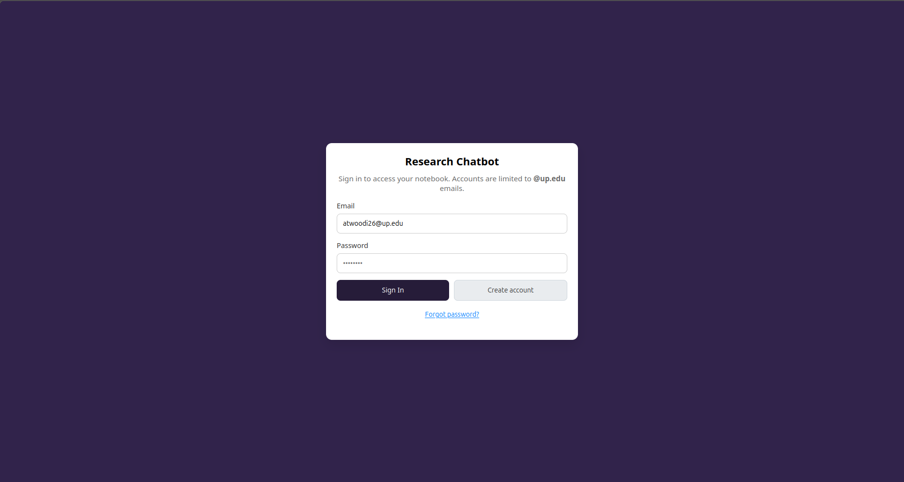
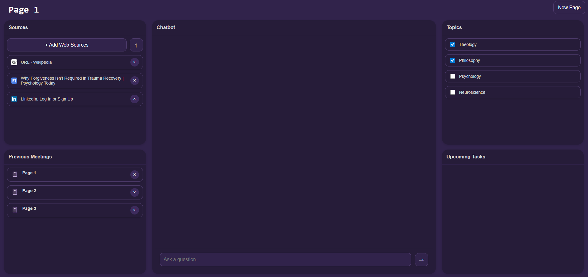

# Research Chatbot

> [!IMPORTANT]
> To access the Chatbot on Virtual Machine or on Staff WiFi, click this [link](http://cs341aiphys:3000).
> This can not currently be accessed using Student WiFi.

Here is the chatbot's tree format:

```
CS341_AI_Chatbot   
└── app
    ├── aibot.sql
    ├── app.js
    ├── babel.config.cjs
    ├── dbms.js
    ├── middleware
    │   └── requireAuthPage.js
    ├── package.json
    ├── package-lock.json
    ├── public
    │   ├── images
    │   │   ├── chatbot.png
    │   │   ├── logout.svg
    │   │   ├── new_page.svg
    │   │   ├── page.svg
    │   │   ├── send.svg
    │   │   └── upload.svg
    │   ├── index.html
    │   ├── javascripts
    │   │   ├── chatLogic.js
    │   │   ├── login.js
    │   │   └── mainScript.js
    │   ├── login.html
    │   ├── popups
    │   │   ├── addDocuments.html
    │   │   └── addSources.html
    │   ├── stylesheets
    │   │   ├── documentPopup.css
    │   │   ├── login.css
    │   │   ├── sourcePopup.css
    │   │   └── style.css
    │   ├── tests
    │   │   ├── chatLogic.test.js
    │   │   └── mainScript.test.js
    │   └── uploads
    │       └── <ChatbotMeetingID>
    │          ├── <UserDocument>
    │          └── <UserDocument>
    └── routes
        ├── auth.js
        ├── documents.js
        ├── loadLogin.js
        ├── pages.js
        ├── searchWeb.js
        ├── topics.js
        ├── urls.js
        └── users.js
```

## `app` Directory
This is the main functionality for the chatbot, it utliizes a few different features: `URL and Document Sources`, `SQL Handling`, and `General Website Code`.

### Standalone Files
* `.env`: contains the API key necessary for the URL search functionality to work. This implements the Brave Search API.
* `aibot.sql`: contains the Database structure for the project, including `pages`, `topics`, `urls`, and `documents` tables.
    * Each `page` entry is connected to their own list of `topics`, `urls`, and `documents`, all referenced by their respective page ID.
        * Note that a `page` is a unique Chatbot Meeting session. 
* `app.js`: routes all of the files in the `app/routes` directory so they might be utilized by the app.
    * Routes contain CRUD and general manipulation of the database.
* `dbms.js`: Database manager that is able to reference the databases, referenced by all `app/routes` files (provided by Dr. Cenek).
* `babel.config.cjs`, `package-lock.json` and `package.json`: reference relevant dependencies and packages necessary for all website functionality.
* `middleware/requireAuthPage.js`: File used for serving the login page when applicable.

### `app/images` Directory
* Contains SVG files for the aesthetic purposes of the website, used from Google symbols for ease of identification.
* Contains .png files for this README documentation.

### `app/public` Directory
* `index.html`: The main HTML file for the website page, contains separate panels for Sources, Previous Meetings, Chatbot, Topics, and Upcoming Tasks.
* `login.html`: The HTML file for the login page, contains sections for signing in, signing up, and changing a password.

* `javascripts/`:
    * `chatLogic.js`: Generates the HTML necessary for displaying various data on the website, also does some code validation.
    * `mainScipt.js`: Where all the rest of the JS lives for the website, calls routes to manipulate the database, handles listeners, etc.
    * `login.js`: Where functional code for login HTML is stored, serves different windows, sends verification codes, password changes, database management, etc.
* `popups/`:
    * `addDocuments.html`: Defines the popup that appears when you upload documents.
    * `addSources.html`: Defines the popup that appears when you search the web.
* `stylesheets/`:
    * `documentPopup.css`: Stylesheet for the Document Popup
    * `sourcePopup.css`: Stylesheet for the Sources Popup
    * `style.css`: The main stylesheet for the main webpage layout.
    * `login.css`: The main stylesheet for the login page layout (innherits some from `style.css`).
* `tests/`:
    * `chatLogic.test.js` and `mainScript.test.js`: Contain Jest testing functions for code coverage.
* `uploads/`:
    * `<ChatbotMeetingID>/*`: Contains files uploaded for each Chatbot session (ChatbotMeetingID).
        * These are stored on the VM but are tracked and referenced in the `documents` table in the database as well.
        * When a Chatbot meeting is deleted, all relevant database information and local documents are deleted along with the meeting.

### `app/routes` Directory
* `auth.js`: Handles login features, sends one-time codes to @up.edu emails for verification.
* `documents.js`: Routes that handle database queries to upload/fetch/delete Documents.
* `users.js` and `searchWeb.js`: Files that handle searching on the web for online sources.
* `loadLogin.js`: Generates the login page.
* `pages.js`: Routes that handle database queries to upload/fetch/delete Pages.
* `topics.js`: Routes that handle database queries to upload/fetch/delete Topics.
* `urls.js`: Routes that handle database queries to upload/fetch/delete URLs.

# How To Use the Chatbot



This is the sign in page, which will load upon accessing the site. If you do not have an account, you can create one using your @up.edu email address. The site will send you a verification code for one-time use, which will allow you to create a password and enter the site. 

You may also reset a password, which will also send a one-time verification code. Once signed in, this is what you will see:



The main functionality of the Chatbot is the middle panel, where the conversation with the LLM occurs. You are able to type in the text area below, and press Enter to query your response.

The website has some functionality to make the user experience more useful and informative.

## The Left Panels
On the left size of the page, you can add `Sources` to upload custom data for the Chatbot to parse and interact with.

The `+ Add Web Sources` button and `↑` button both launch an intuitive popup for source selection. You can search the web, select your desired webpage, and add it to the Chatbot's listed resources. In Upload Documents popup, you can select files from your computer's local directory for Chatbot use.

Below this panel is the `Previous Meetings` section where you can click through the previous sessions you've had with the Chatbot. Each of these pages store their specific URLs, uploaded documents, selected topics, and Chatbot message history. To create a new page, select the `New Page` button in the top right corner of the screen. This will create a fresh interface in which you can manipulate its data for your needs.

## The Right Panels
On the right size of the page, the `Topics` section is where you may select the Chatbot's specific field of expertise. This switches between the LLM models, allowing for a broader range of highly specific information and analysis.

The `Upcoming Tasks` section is a user tool that is meant to keep track of upcoming tasks and deadlines. This is an extra feature and does not impact the Chatbot's responses.

# FINAL DETAILS

## Jest Code Coverage (as of Sprint 5)
---------------|---------|----------|---------|---------
File           | % Stmts | % Branch | % Funcs | % Lines                                                                                    
---------------|---------|----------|---------|---------                                                                                                      
 chatLogic.js  |     100 |       60 |     100 |     100                                                                                                
 mainScript.js |   60.86 |    38.04 |   72.91 |   62.88  
---------------|---------|----------|---------|---------

## App Runtime
For each .html file:
* `login.html`: 13ms
* `index.html` (after successful login): 9ms
* `addDocuments.html`: 4ms
* `addSources.html`: 6ms

## Compatible Browsers
Tested on Firefox and Chrome on Windows and Linux. This app is not designed for mobile browser usage.

> [!NOTE]
> There is a [documented bug](https://github.com/Gonon-UP/CS341_AI_Chatbot/issues/12) where disabling the warning message for deleting Previous Meetings results in an inability to delete other Previous Meetings, though it was unable to be replicated and the affected browser was also unspecified.

## Security
In order to protect the client's information, the app launches a sign-in page upon starting. If the user does not have an account, it prompts the user to create one using their @up.edu email. A one-time verification code is sent to their email to verify their UP affiliation. Their password is stored in our database using an encrypted hash function.
* This app uses Node.js [bcrypt](https://www.npmjs.com/package/bcrypt) features for secure encryption and decryption.

## Resolved Bugs
[BUG #1](https://github.com/Gonon-UP/CS341_AI_Chatbot/issues/16): Adding a URL directly to the Sources list.

[BUG #2](https://github.com/Gonon-UP/CS341_AI_Chatbot/issues/13): Accessing README.txt resulting in 'error: not found'.

## Unresolved Bugs
[BUG #3](https://github.com/Gonon-UP/CS341_AI_Chatbot/issues/14): Uploaded Documents not appearing in Sources list.
* This is an intentional choice, for large document uploads, we didn't want the Sources to be cluttered. This is meant for URLs only.

[BUG #4](https://github.com/Gonon-UP/CS341_AI_Chatbot/issues/17) and [BUG #5](https://github.com/Gonon-UP/CS341_AI_Chatbot/issues/12): Previous Meetings unable to be deleted.
* This bug did not seem to persist on Firefox nor Chrome, so it has not been resolved (unable to replicate).

[BUG #6](https://github.com/Gonon-UP/CS341_AI_Chatbot/issues/18) and [BUG #7](https://github.com/Gonon-UP/CS341_AI_Chatbot/issues/15): Chats between user and Chatbot are not saved between pages.
* This is a feature that is meant to be completed by Sprint 5.

